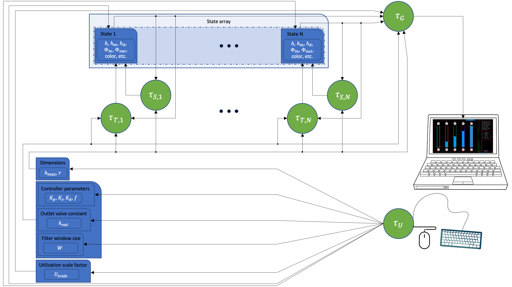
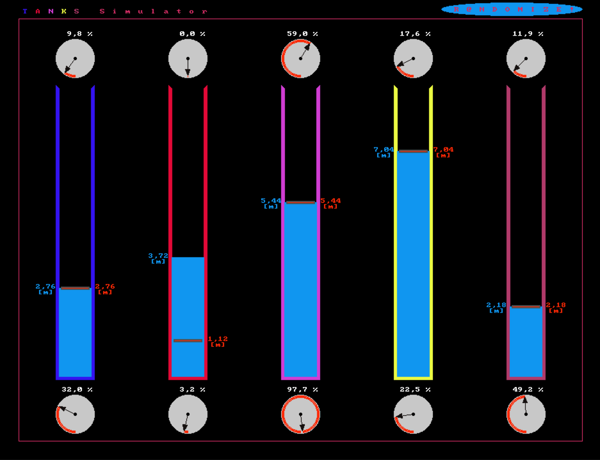
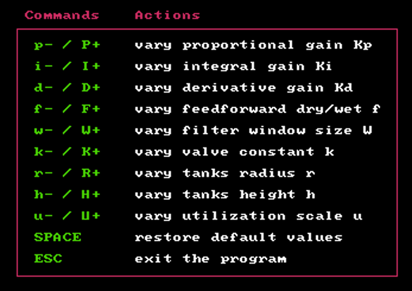
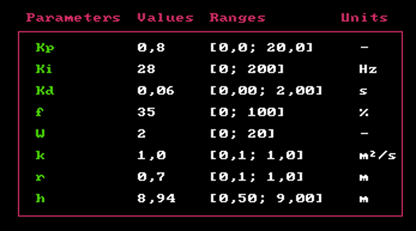
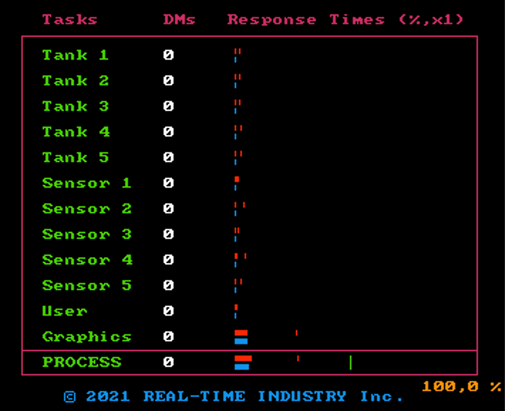

<p align="center" width="100%">
     
</p>

<p align="center">
	<a href="#prerequisites">Prerequisites</a>
	<span> • </span>
	<a href="#compile">Compile</a>
	<span> • </span>
	<a href="#execute">Execute</a>
	<span> • </span>
	<a href="#commands">Commands</a>
	<span> • </span>
	<a href="doc/report.pdf">Documentation</a>
	<span> • </span> 
	<a href="#gui">Screenshots</a>
	<span> • </span>
	<a href="demo/demo.mp4">Demo</a>
</p>

<p align="center" width="100%">
     
</p>

## <a id="prerequisites"></a>Prerequisites

* [Allegro 4](https://liballeg.org/stabledocs/en/index.html) - A cross-platform, open-source graphics library for game and multimedia programming. To install Allegro 4.4 under Ubuntu (or derivatives thereof), execute these commands from the terminal:

	```bash
	sudo apt update
	sudo apt install liballegro4.4 liballegro4-dev allegro4-doc
	```
* [EasyPThread](https://github.com/vbisog/lib-easypthread) - An educational real-time C library.

## <a id="compile"></a>How to compile

* To compile the project the first time:

	1. Move the `tanksimulator-main` folder (from now on referred to as `tanksimulator-main/`) where thou prefer.
	2. Launch a terminal window and navigate to `tanksimulator-main/`.
	3. Create the `obj` folder and move it inside `tanksimulator-main/`, i.e., `tanksimulator-main/obj/`.
	4. Type:

    	```bash
    	make
    	```

* To compile the project again:

	1. Navigate to `tanksimulator-main/`.
	2. Type:

    	```bash
    	make
    	```

* To compile the project from scratch:

	1. Navigate to `tanksimulator-main/`.
	2. Type:

    	```bash
    	make clean
    	make
    	```

## <a id="execute"></a>How to execute

The compilation produces the executable file `tanksimulator-main/main`. The program should be run as superuser (i.e., root user), e.g.,

```bash
sudo ./main
# Type your super secret password
```

## Tasks

The system has N liquid tanks, where N is equal to 5. There are a total of 12 periodic tasks, 2 for each tank plus 2 additional tasks:

* τ<sub>T,1</sub>, ..., τ<sub>T,N</sub>: tasks responsible for tank management
* τ<sub>S,1</sub>, ..., τ<sub>S,N</sub>: tasks responsible for sensor management
* τ<sub>U</sub>: task responsible for user input management
* τ<sub>G</sub>: task responsible for graphics management

The following diagram illustrates the relationship between tasks and resources:




## <a id="gui"></a>GUI:

The GUI of the liquid tank control system is designed to provide an intuitive user interface. Here are some of its features:

#### Overview

Liquid tanks with their inlet and outlet valves and randomizer button:

<p align="center">
     
</p>

#### Keyboard commands
A set of keyboard commands is available to control the system. More detailed instructions are in the [next section](#commands).

<p align="center">
     
</p>

#### Parameter ranges and values
The GUI displays the range and current value of each adjustable parameter of the control system.

<p align="center">
     
</p>

#### Tasks analyzer
The GUI includes a task analyzer that displays task Deadline Misses and Response Times (instantaneous, red bar, average, blue bar, and maximum, red rightest thin line, respectively). It is powered by the [EasyPThread](https://github.com/vbisog/lib-easypthread) library.

<p align="center">
     
</p>


## <a id="commands"></a>Commands

### <a id="mouse-commands"></a>Mouse Commands

The following table lists the mouse commands available in the system:

| Movement | Action |
| --- | --- |
| Click on a tank | Sets the desired liquid level (indicated by a red horizontal bar) |
| Left-click and drag on an outlet valve | Adjusts the valve opening to control the flow rate of the liquid |
| Click the r@andomizer button | Randomizes all the system parameters and tank colors |

### <a id="keyboard-commands"></a>Keyboard Commands

The following table lists the keyboard commands available in the system:


| Key	| Action | Range | SI Unit
| --- | --- | --- | --- |
| P<br>p	| Increases proportional gain by 0.2 <br> Decreases proportional gain by 0.2 | [0, 20] | - |
| I<br>i	| Increases integral gain by 2 Hz <br> Decreases integral gain by 2 Hz | [0, 200] | Hz |
| D<br>d	| Increases derivative gain by 0.02s <br> Decreases derivative gain by 0.02s | [0, 2] | s |
| F<br>f	| Increases feedforward dry/wet ratio by 5% <br> Decreases feedforward dry/wet ratio by 5% | [0, 100] | % |
| W<br>w	| Increases filter window size by 1 <br> Decreases filter window size by 1 | [0, 20] | - |
| K<br>k	| Increases valve constant by 0.1 m²/s <br> Decreases valve constant by 0.1 m²/s | [0.1, 1] | m²/s |
| R<br>r	| Increases tanks radius by 0.1 m <br> Decreases tanks radius by 0.1 m | [0.1, 1] | m |
| H<br>h	| Increases tanks height by 0.02 m <br> Decreases tanks height by 0.02 m | [0.5, 9] | m |
| U<br>u	| Increases utilization scale by 1 <br> Decreases utilization scale by 1 | [0.5, 20] | - |
| SPACE | Restores default values |
| ESC | Exits the program |