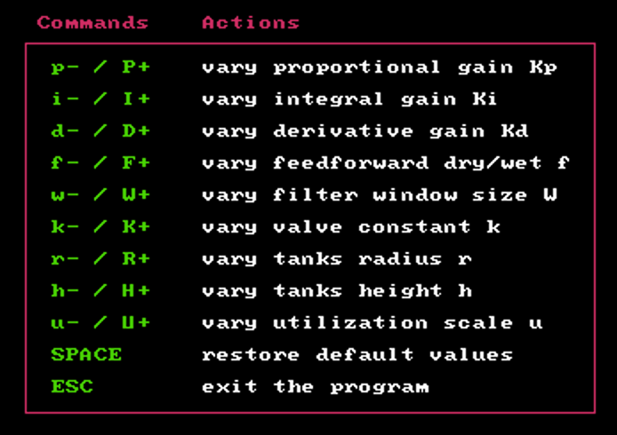

# __Tanks Project__

### _Author_: Livio Bisogni
###### __&copy; 2021 REAL-TIME INDUSTRY Inc.__
___
Is that water?

## Prerequisites

* [Allegro 4](https://liballeg.org/stabledocs/en/index.html) - A cross-platform, open-source graphics library for game and multimedia programming. To install Allegro 4.4 under Ubuntu (or derivatives thereof), execute these commands from the terminal:

```
$ sudo apt update
$ sudo apt install liballegro4.4 liballegro4-dev allegro4-doc
```
* [MyPtask](https://github.com/kimjong0xff/myptask-master) - An educational real-time library.

## How to compile

To compile the project:

1. Move the `tanksimulator` folder (from now on referred to as `tanksimulator/`) where thou prefer.
2. Launch a terminal window and navigate to `tanksimulator/`.
3. Type:

    ```
    $ make
    ```

To compile the project from scratch:

1. Navigate to `TanksProject-master/`.
2. Type:

    ```
    $ make clean
    $ make
    ```

## How to execute

The compilation produces the executable file `TanksProject-master/main`. The program should be run as superuser (i.e., root user), e.g.,

```
$ sudo ./main
$ # Type your super secret password
```

## No, that's _magic_ water!
Let N, N = 5, be the number of tanks. Hence, there are n = 2 * (N + 1) = 12 periodic tasks:

* &tau;<sub>T,1</sub>, ..., &tau;<sub>T,N</sub> tank tasks;
* &tau;<sub>S,1</sub>, ..., &tau;<sub>S,N</sub> sensor tasks;
* &tau;<sub>U</sub> user task;
* &tau;<sub>G</sub> graphics task.

This figure shows the tasks-resources diagram:


You can find more about this project on the attached [pdf](https://github.com/kimjong0xff/tanksimulator/blob/main/project-report.pdf). Yeah, that's available in Italian only, though (sorry folks).

Finally, here are some screenshots of the GUI:





